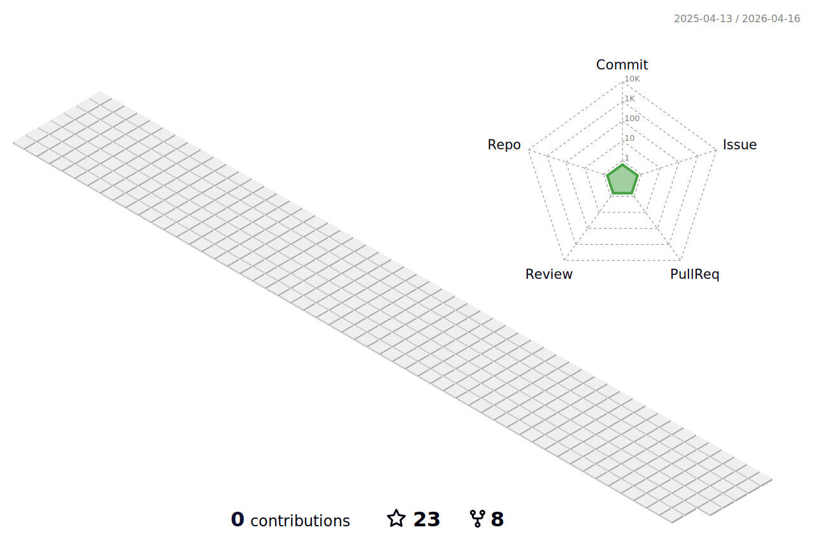

# Hey there👋, Welcome to my Github Profile

# 💫 About Me:
🌱 I’m currently learning c++, Appdevelopment  
🔭 I’m looking to collaborate on Opensource  
💬 Ask me about Android, flutter  
📫 How to reach me naaperupardhu@gmail.com  
⚡ Fun fact: I spend much time listening to songs 

## 🌐 Socials:
    

# 💻 Tech Stack:
     

# 📊 GitHub Stats:
<!--   -->
 

|  |  |

<!-- ## 🏆 GitHub Trophies
 -->

## Contribution graph get eaten by snake 🐍

---

