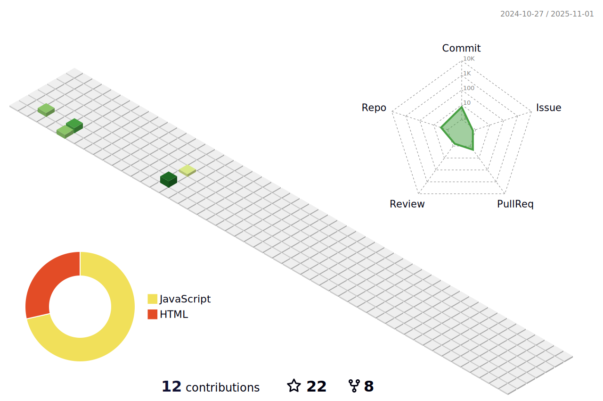

# Hey there👋,  I'm Perumall

# 💫 About Me:
🌱 I’m currently learning C++, DSA, NodeJS, Flutter  
🔭 I’m looking to collaborate on Opensource  
💬 Ask me about Data Structures and Algorithms  
📫 How to reach me naaperupardhu@gmail.com  
⚡ Fun fact: I spend much time listening to songs  

<h3 align="left">Connect with me:</h3>

<h3 align="left">Languages and Tools:</h3>

                   

## 📊 GitHub Stats:
  

<!-- ## 🏆 GitHub Trophies

 -->

<!--  ## Contribution graph gets eaten by snake 🐍
 -->

<!--  -->

<!--  -->

---

